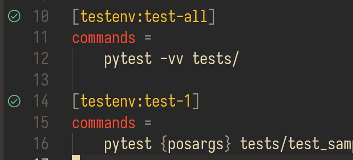

# python-tox extension for Visual Studio Code

<a href="https://tox.readthedocs.io">
    
    
</a>


[](https://marketplace.visualstudio.com/items?itemName=the-compiler.python-tox)
[](https://marketplace.visualstudio.com/items?itemName=the-compiler.python-tox)
[](https://marketplace.visualstudio.com/items?itemName=the-compiler.python-tox)

[](https://open-vsx.org/extension/the-compiler/python-tox)
[](https://open-vsx.org/extension/the-compiler/python-tox)
[](https://open-vsx.org/extension/the-compiler/python-tox)

[](https://github.com/The-Compiler/vscode-python-tox/actions/workflows/ci.yml)
[](https://github.com/sponsors/The-Compiler/)

This extension integrates the [tox](https://tox.readthedocs.io/) task automation tool with Visual Studio Code.

## Features

Commands to run single or multiple tox environments, with or without additional
arguments:


Integration with VS Code's testing feature when opening a `tox.ini` file:



Hover information for environment variables while editing a `tox.ini` file:


## Installing

- Install the extension via the [Visual Studio
Marketplace](https://marketplace.visualstudio.com/items?itemName=the-compiler.python-tox)
or the [Open VSX
Registry](https://open-vsx.org/extension/the-compiler/python-tox)

- make sure that [tox](https://github.com/tox-dev/tox) is installed.

- finally, run one of the [commands](#extension-commands) via the command palette
or bind them to a shortcut. No default shortcuts are provided.

For [VSpaceCode](https://vspacecode.github.io/), consider a configuration such as:

```jsonc
    "vspacecode.bindingOverrides": [
        {
            "keys": ["m", "languageId:python", "c", "t"],
            "name": "+Tox",
            "icon": "play",
            "type": "bindings",
            "bindings": [
                {
                    "key": "t",
                    "name": "Run tox",
                    "icon": "play",
                    "type": "command",
                    "command": "python-tox.select"
                },
                {
                    "key": "T",
                    "name": "Run tox with arguments",
                    "icon": "play-circle",
                    "type": "command",
                    "command": "python-tox.selectWithArgs"
                },
                {
                    "key": "m",
                    "name": "Run tox (multiple)",
                    "icon": "run-all",
                    "type": "command",
                    "command": "python-tox.selectMultiple"
                },
                {
                    "key": "M",
                    "name": "Run tox (multiple) with arguments",
                    "icon": "run-all",
                    "type": "command",
                    "command": "python-tox.selectMultipleWithArgs"
                },
                {
                    "key": "?",
                    "name": "Show tox documentation",
                    "icon": "book",
                    "type": "command",
                    "command": "python-tox.openDocs"
                }
            ]
        },
        // ...
    ]
```

To get a development build of the latest commit, you can:

- Go to the [GitHub Actions tab](https://github.com/The-Compiler/vscode-python-tox/actions/workflows/ci.yml),
  view the newest passing run and download an automated build from the "Artifacts" section.
- Or clone the repository and run `npm run package`

Then install the resulting `.vsix` file using the command palette and selecting
"Extensions: Install from VSIX...".

## Extension Commands

- `python-tox.select`: Show a menu allowing to pick a tox environment.
- `python-tox.selectWithArgs`: Show a menu allowing to pick a tox environment, then ask for custom arguments.
- `python-tox.selectMultiple`: Show a menu allowing to pick multiple tox environments.
- `python-tox.selectMultipleWithArgs`: Show a menu allowing to pick multiple tox environments, then ask for custom arguments.
- `python-tox.openDocs`: Open the tox documentation in the web browser.

## Suggested extensions

- [Ini for VSCode](https://marketplace.visualstudio.com/items?itemName=DavidWang.ini-for-vscode) for simpler navigation of large `tox.ini` files.

## Release Notes

See [CHANGELOG.md](CHANGELOG.md).

## Releasing checklist

- Double-check the CI
- `npm version <major|minor|patch>`
- `git push origin`
- `git push origin vX.Y.Z`
- Lean back and let the CI do the rest
